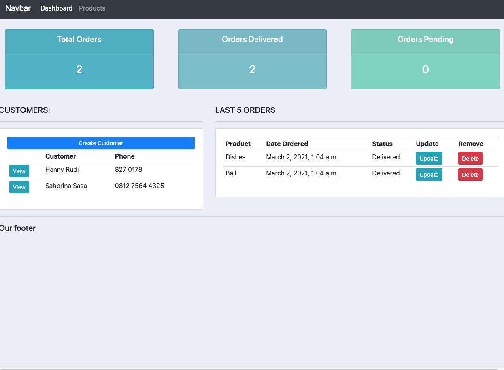
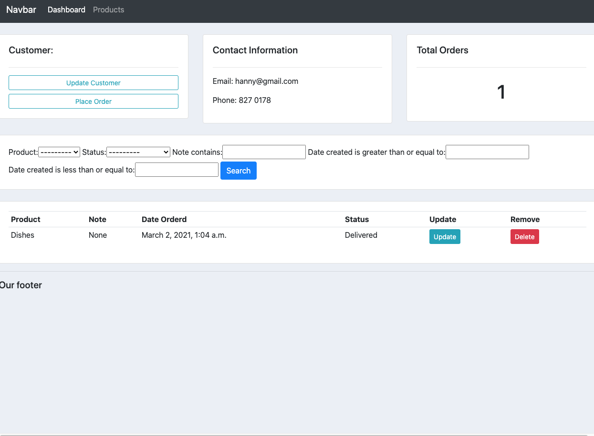
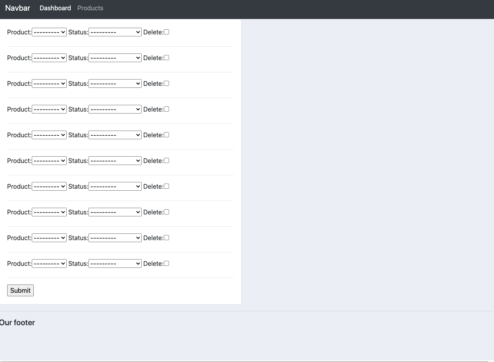

# crm-app
3 fitur utama crm-app ini:

1.fitur dashboard untuk melihat database yang masuk (e.g.: jumlah order dll)
2.fitur menambahkan kustomer dan menampilkan (crud method)

3. fitur melihat detail kustomer dan order kustomer 

4. fitur menambahkan order (table relasi antara produk dan kustomer)

